# Enterprise Security Assessment — Waffarah E-Commerce Platform

<p align="left">
  
  
  
</p>

| | |
|---|---|
| **Author** | Joud Alhussain |
| **Date** | August 2026 |
| **Methodology** | OWASP Testing Guide (OWASP Top 10 focus) |
| **Tools Used** | Nmap, curl, Chrome DevTools, OWASP Juice Shop |
| **Report** | [PDF Report](./report) |

---

## 📋 Project Overview

This project simulates a consultant-style black-box security assessment of Waffarah, a fictional mid-size e-commerce company, ahead of a compliance audit. The assessment identifies and validates vulnerabilities in the customer-facing web application, scores them by risk, and delivers a remediation roadmap in the same format a professional security consultancy would provide to a paying client.

## 🏢 Business Scenario

Waffarah is a mid-size e-commerce company (~150 employees) handling customer orders and payment data. Ahead of an upcoming regulatory compliance audit, Waffarah's leadership engaged an external security consultant to independently assess their web application for vulnerabilities that could expose customer data or damage the business.

## 🎯 Objectives

- Identify exploitable vulnerabilities in Waffarah's customer-facing web application
- Validate findings with evidence (not just automated scan output)
- Score each finding by likelihood and business impact
- Deliver a prioritized, business-readable remediation roadmap

## 🔍 Scope

**Target of Assessment:** Waffarah's customer-facing web application (simulated using OWASP Juice Shop, a deliberately vulnerable app used here to stand in for the client's real platform).

**Testing Type:** Black-box (no prior access to source code or credentials — testing performed as an external, unauthenticated attacker would).

**In Scope:**
- Web application functionality (login, search, checkout, product reviews, complaint form)
- API endpoints exposed by the application
- Session and authentication mechanisms
- Server/directory configuration reachable via the web root

**Out of Scope:**
- Denial-of-Service (DoS) testing
- Social engineering or phishing
- Physical security testing
- Any infrastructure outside the deployed Juice Shop instance
- Execution of any downloaded/quarantined files discovered during testing

**Authorization:** This assessment was conducted with the full knowledge and authorization of Waffarah management, under a signed (fictional) engagement agreement, strictly for portfolio and educational purposes.

## 🧭 Methodology

This assessment follows the OWASP Testing Guide, with findings mapped against the OWASP Top 10. Testing proceeded in four stages: reconnaissance and scanning, manual validation of scan results, risk scoring, and business-impact reporting.

**Severity rating criteria:**

**Likelihood**
| Level | Definition |
|---|---|
| High | Exploitable with no special access, tools, or skill — a basic payload works, or it's trivially discoverable |
| Medium | Requires some effort — knowing where to look, crafting a working payload, or needing a valid account |
| Low | Requires specific conditions, insider knowledge, or significant effort/luck |

**Impact**
| Level | Definition |
|---|---|
| High | Full compromise of confidentiality, integrity, or availability |
| Medium | Partial compromise — some sensitive data/functionality exposed, not full system control |
| Low | Limited consequence on its own — aids further attacks but doesn't directly grant access |

Likelihood × Impact combine into overall severity via a standard risk matrix (below), consistent with the OWASP Risk Rating Methodology.

## 🖥️ Environment

| Component | Detail |
|---|---|
| Target | OWASP Juice Shop (Docker) — standing in for Waffarah's platform |
| Attacker system | Kali Linux (WSL) |
| Network | Isolated local environment (localhost, no external exposure) |

---

## ⚙️ Execution

### 1. Reconnaissance & Scanning

A full TCP port scan (all 65,535 ports) was run against the target:

```
nmap -sV -p- localhost

Not shown: 65534 closed tcp ports (reset)
PORT     STATE SERVICE VERSION
3000/tcp open  ppp?
```

Only one port was exposed. Nmap's automated service detection returned a low-confidence, incorrect guess (`ppp?`); manual analysis of the raw HTTP response — and cross-validation via `curl -I http://localhost:3000` and Chrome DevTools — confirmed the service as an HTTP web application (OWASP Juice Shop).

**Note on methodology:** an initial targeted script scan (`--script=http-title,http-headers,http-methods`) was run without the `-sV` flag and silently failed to trigger, since Nmap's scripting engine depends on correct service identification first. Repeating the scan with `-sV` included, and cross-checking with `curl`, resolved this and confirmed the following response headers:

- `Access-Control-Allow-Origin: *` — wildcard CORS policy
- `Access-Control-Allow-Methods: GET,HEAD,PUT,PATCH,POST,DELETE` — state-changing methods enabled
- `X-Recruiting: /#/jobs` — custom header disclosing a hidden client-side route (manually followed; confirmed as a dead end with no exploitable content)

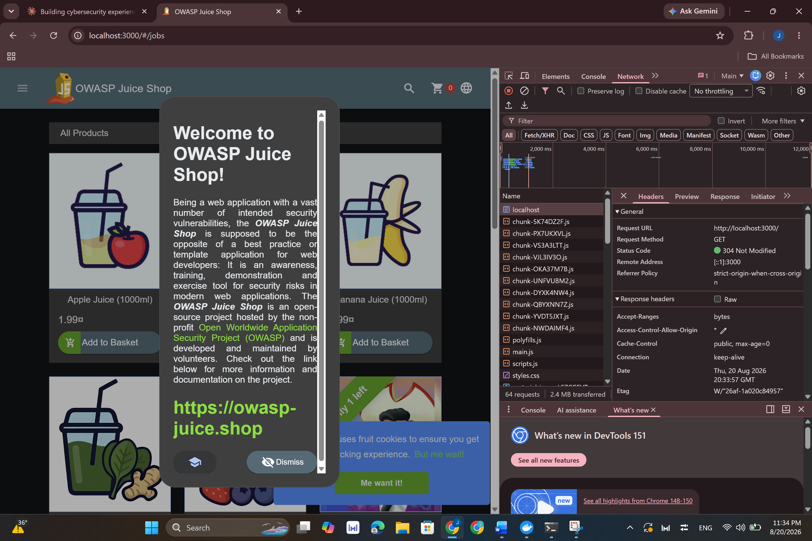

### 2. Authentication Testing

A classic SQL injection authentication bypass payload was tested against the login form:

- **Email field:** `admin@juice-sh.op' --`
- **Password field:** any value

This successfully bypassed authentication and logged in as the administrator account with no valid password.

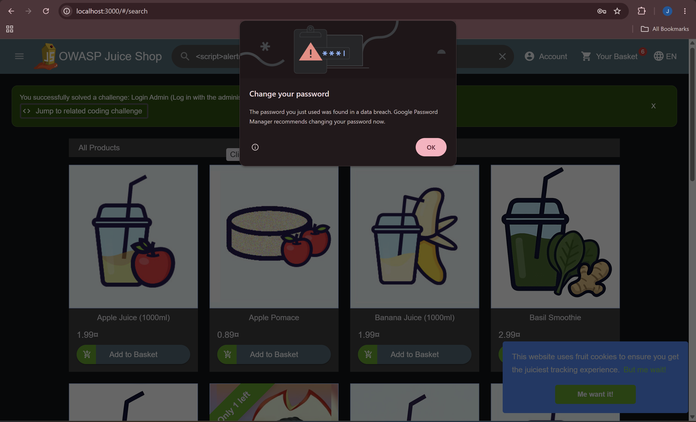

### 3. Post-Authentication Access Review

With the admin session obtained above, the following areas were reviewed:

- `/administration` — fully accessible, listing all registered user accounts and customer feedback

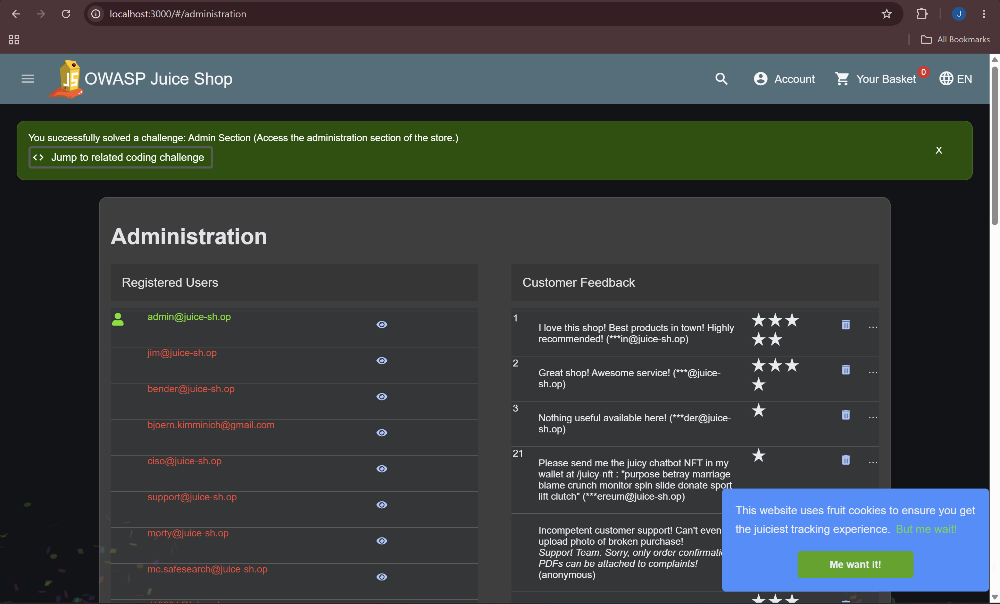

- Individual user records use sequential, predictable numeric IDs (e.g. "User #2"), visible via the admin panel's user detail view

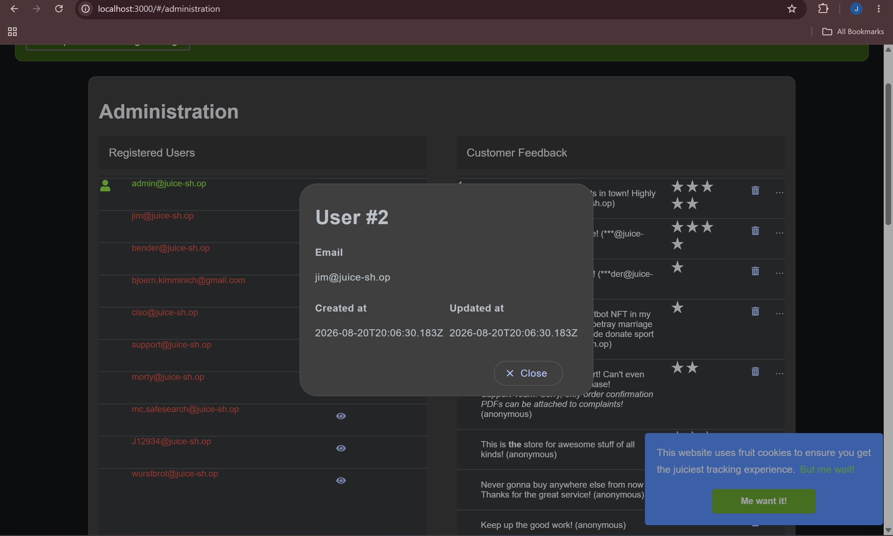

- The digital wallet feature allowed adding funds with no real payment validation

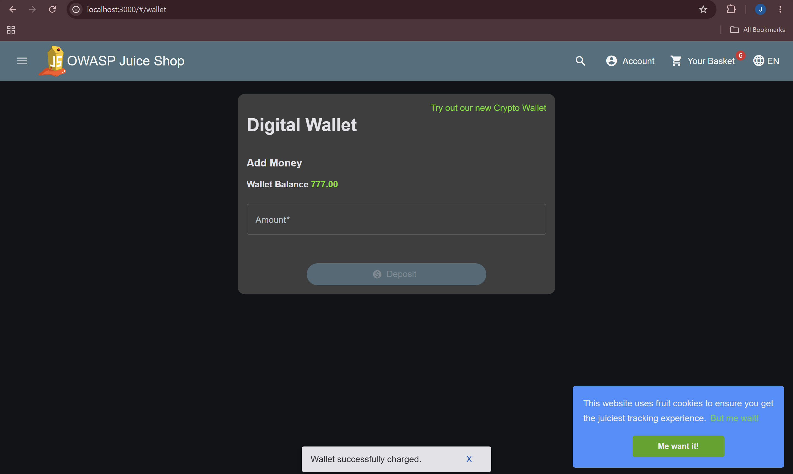

- Saved payment methods (masked card numbers, expiry dates) and saved address (PII) were both fully visible for the admin account

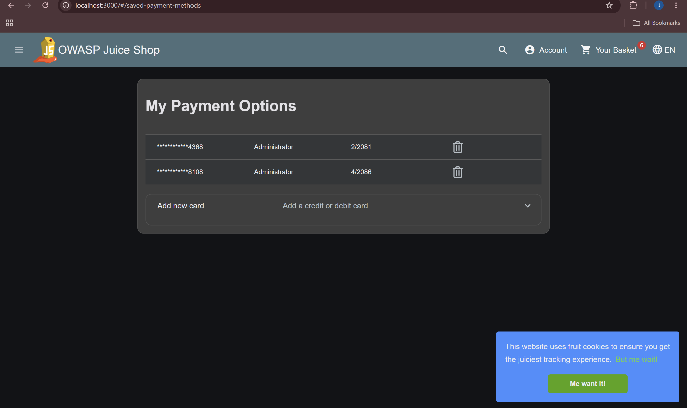
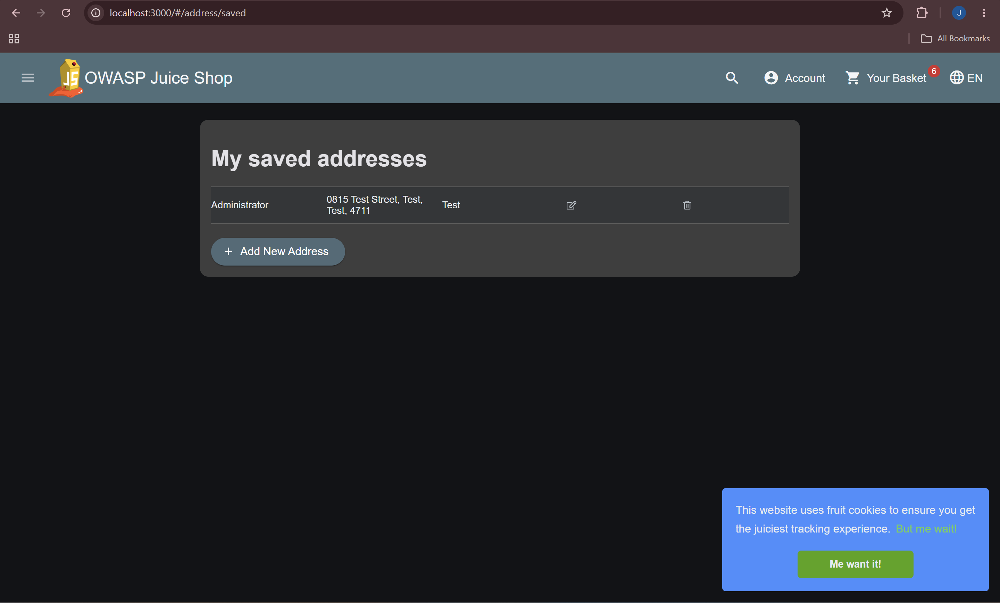

### 4. Cross-Site Scripting (XSS) Testing

The product search field was tested with multiple payloads:

- `<script>alert('test')</script>` — filtered, no execution
- `<iframe src="javascript:alert(\`xss\`)">` — **executed successfully**, confirming a DOM-based XSS vulnerability and incomplete input sanitization

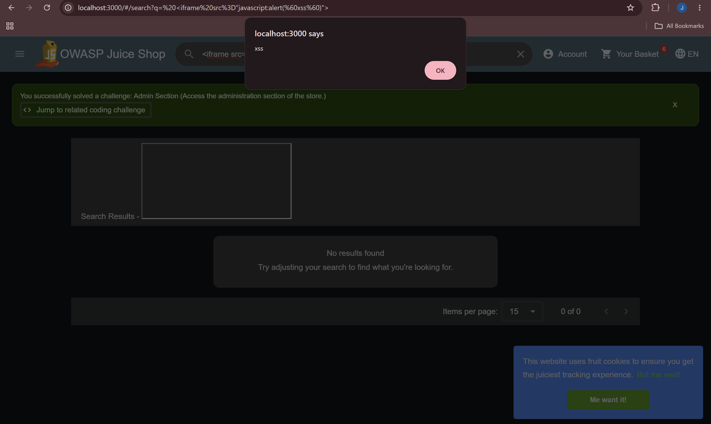

A basic SQL injection payload was also tested in the search field (`')) UNION SELECT * --`); this returned a clean "no results found" state with no error or data leakage.

### 5. Access Control Testing (IDOR)

Direct access to another user's shopping basket was attempted by requesting `/rest/basket/1` and `/rest/basket/2` directly, without a valid session token. Both requests correctly returned `401 Unauthorized: No Authorization header was found` — confirming this endpoint is **not** vulnerable to unauthenticated ID enumeration.

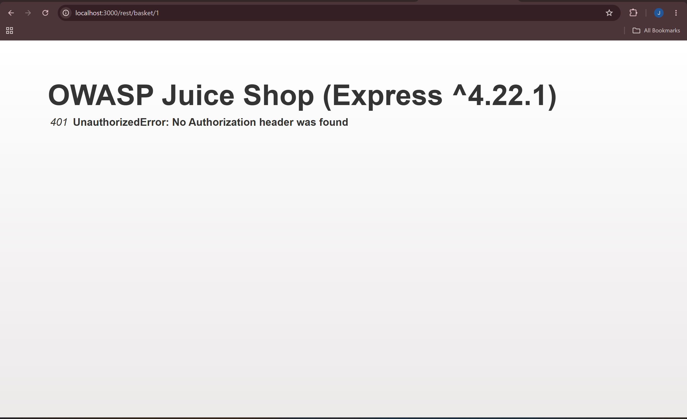

Order history was also confirmed to be correctly scoped to the logged-in user only, with no cross-user data visible.

### 6. Password Reset / Security Question Testing

The "Forgot Password" flow for the admin account was tested. The account uses "Mother's maiden name?" as its security question — a question type widely discouraged by industry guidance (OWASP, NIST) due to real-world guessability via public records or social media. Several common surname guesses were attempted; none succeeded against this account.

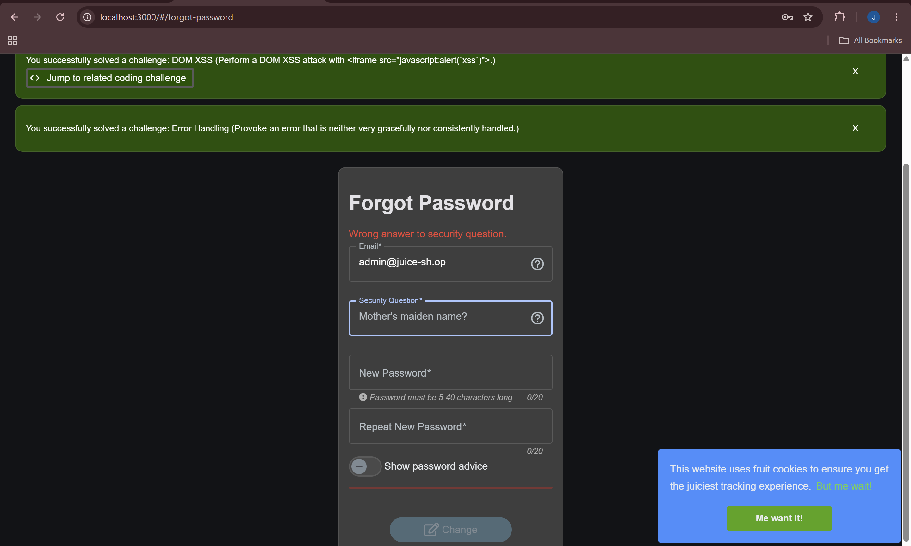

### 7. File Upload Testing

The complaint form's invoice upload field restricts file selection to `.pdf` via the browser file picker (a client-side-only control). An attempt was made to test server-side content validation using a renamed file; this test was **inconclusive** due to a local environment file-extension display issue, and is documented honestly as such rather than claimed as a confirmed result either way.

### 8. Directory & Information Disclosure Testing

`robots.txt` was reviewed and found to explicitly disallow `/ftp` — ironically confirming the existence of a path that should not have been discoverable at all:

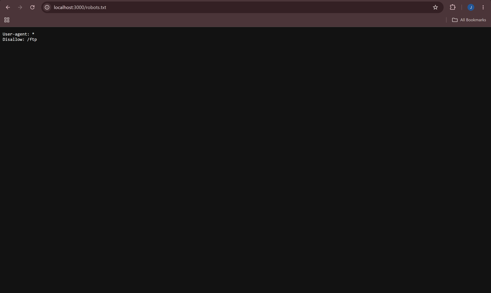

Navigating directly to `/ftp` revealed a fully browsable directory listing, including backup files (`.bak`), a KeePass password database file (`.kdbx`), and business-document-named files:

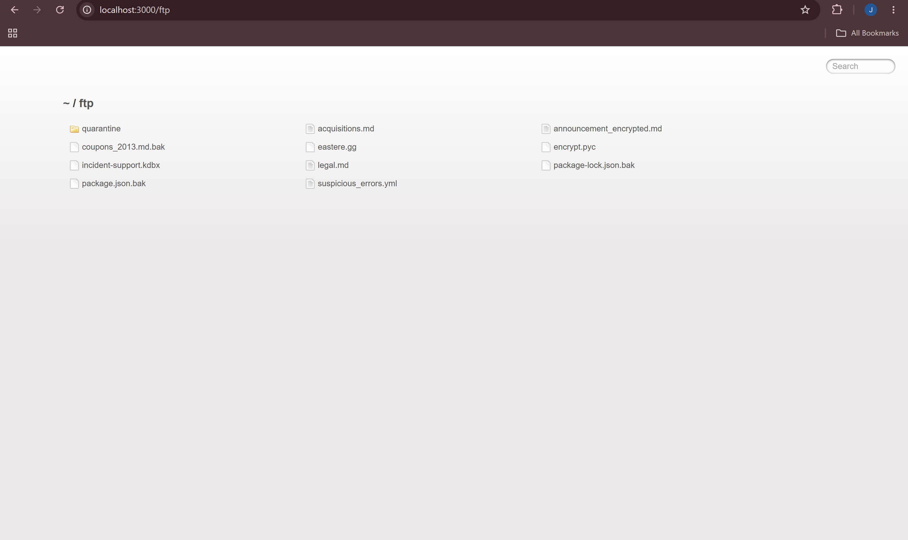

The documents labelled "confidential" (`acquisitions.md`, `legal.md`) were found to contain placeholder (Lorem ipsum) text in this instance — however, the exposure mechanism itself remains a valid, serious finding, since production data could be present in a real deployment.

A `quarantine` subfolder was also discovered containing files with malware-suggestive names (e.g. `juicy_malware_windows_64.exe.url`). In line with safe testing practice, these files were identified and logged but **not opened, downloaded, or executed**.

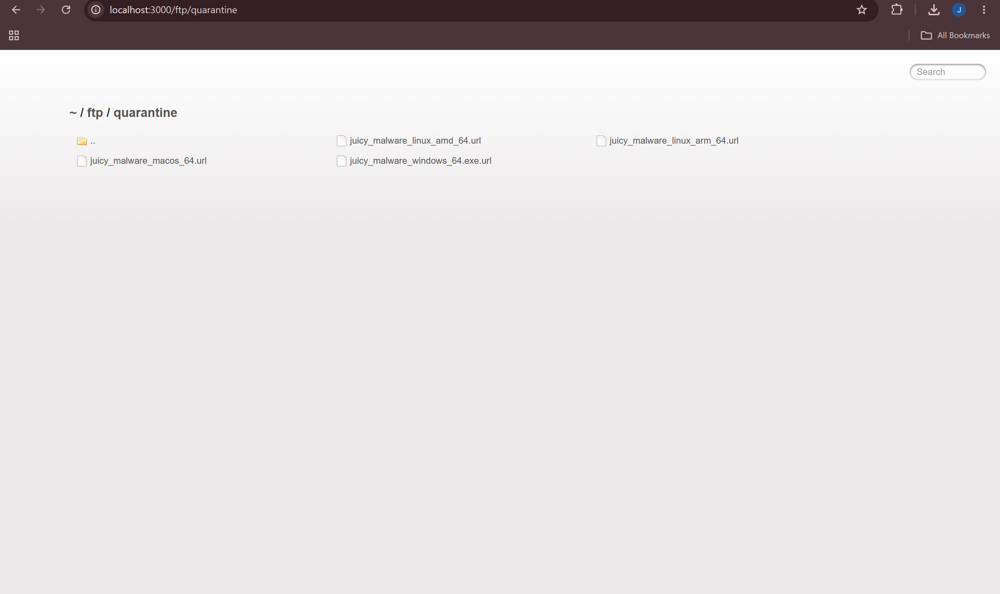

---

## 🔎 Findings Summary

| # | Finding | Category | Risk Rating |
|---|---|---|---|
| 1 | SQL Injection → Admin Authentication Bypass | Injection | **Critical** |
| 2 | Broken Access Control — Full Admin Panel Access (PII & payment data exposure) | Broken Access Control | **Critical** |
| 3 | Directory Listing Exposure (backup files, exposed `.kdbx` credential file) | Security Misconfiguration | **High** |
| 4 | Cross-Site Scripting (DOM-based, search field) | Injection / XSS | **Medium-High** |
| 5 | Business Logic Flaw — Wallet Balance Manipulation | Business Logic | **Medium** |
| 6 | Predictable Sequential User IDs | Information Disclosure | **Low-Medium** |
| 7 | CORS Wildcard Policy (`Access-Control-Allow-Origin: *`) | Security Misconfiguration | **Low-Medium** |
| 8 | Weak Security Question Type (Password Reset) | Authentication Design | **Low-Medium** |
| 9 | Verbose Error Handling (framework & version disclosure) | Information Disclosure | **Low** |

**Positive findings (controls working correctly):**
- Basket access properly rejects unauthenticated requests (`401 Unauthorized`)
- Order history correctly scoped to the logged-in user only
- Login error messages are appropriately generic (no user enumeration via error text)
- Registration enforces standard password complexity rules

### Risk Matrix

| Likelihood → / Impact ↓ | Low | Medium | High |
|---|---|---|---|
| **High** | Verbose error handling | — | **SQL Injection**, **Admin Panel Access** |
| **Medium** | — | XSS, Wallet manipulation | Directory listing exposure |
| **Low** | — | CORS wildcard, Weak security question | — |

---

## 💼 Business Impact

The assessment identified a critical vulnerability chain originating from a SQL injection flaw in Waffarah's authentication system. This flaw allows an unauthenticated attacker to bypass login entirely and gain full administrative access — exposing customer personal data, stored payment card details, and enabling manipulation of customer wallet balances. Combined with a directory listing misconfiguration exposing backup files and a credential database, and a cross-site scripting vulnerability in the product search function, these findings represent significant risk to customer data confidentiality, regulatory compliance (particularly under NCA/CST requirements), and business reputation. Remediation of the SQL injection vulnerability should be treated as the highest priority, as it is the root cause enabling the majority of high-severity findings.

## ✅ Recommendations

| # | Finding | Recommendation | Priority |
|---|---|---|---|
| 1 | SQL Injection → Admin Auth Bypass | Replace raw string-concatenated SQL queries with parameterized queries / prepared statements. Apply input validation on all authentication fields. | Immediate |
| 2 | Broken Access Control — Admin Panel | Enforce server-side role checks on every admin route, not just UI-level hiding of admin links. | Immediate |
| 3 | Directory Listing Exposure | Disable directory listing at the web server/framework level. Remove backup and credential files from any publicly reachable path entirely. | Immediate |
| 4 | XSS (Search bar, DOM-based) | Sanitize and encode all user input before rendering it in the DOM. Apply a Content-Security-Policy header as defense in depth. | High |
| 5 | Business Logic Flaw — Wallet Balance | Validate all wallet top-up requests against a real payment processor server-side; never trust client-submitted amounts. | High |
| 6 | Predictable Sequential User IDs | Use non-sequential, non-guessable identifiers (e.g. UUIDs) for user records. | Medium |
| 7 | CORS Wildcard Policy | Restrict `Access-Control-Allow-Origin` to a defined allowlist of trusted domains. | Medium |
| 8 | Verbose Error Handling | Return generic error messages in production; log full stack traces server-side only. | Medium |
| 9 | Weak Security Question Type | Replace with email-based or token-based password reset flows. | Medium |

## 📚 Lessons Learned

- **Automated tools have blind spots.** Nmap's version detection misidentified the target service despite returning full, readable HTTP data — reinforcing that manual verification via curl and browser DevTools is essential, not optional.
- **Defenses are rarely all-or-nothing.** The search bar blocked a basic `<script>` XSS payload but was still exploitable via an alternate `<iframe>` vector, showing the value of testing multiple payload variations before concluding an input is safe.
- **Not every lead pays off, and that's fine to document.** The file upload validation test was inconclusive due to a local environment quirk. Documenting it honestly as inconclusive is more credible than overstating a result either way.
- **Positive findings matter as much as flaws.** Confirming that the basket endpoint correctly rejected unauthenticated requests, and that order history was properly scoped, made the overall report more balanced and realistic.
- **One root-cause vulnerability can cascade.** The SQL injection flaw alone enabled a full downstream chain of impact, reinforcing why prioritizing root-cause fixes matters more than patching symptoms individually.
- **Infrastructure setup is its own skill.** Getting Docker, WSL, and Kali working reliably together required real troubleshooting (virtualization settings, WSL installation, password resets) — a reminder that tooling competency is as much a part of this work as the testing itself.

## 📎 Repository Resources

- 📄 [Full PDF Report](./report)
- 💼 [LinkedIn Post](#)
- 🖼️ [Screenshots / Evidence](./evidence)

---
<p align="center"><i>Part of the <a href="https://github.com/JoudAlhussain/JoudAlhussain">Cybersecurity Professional Portfolio</a></i></p>
